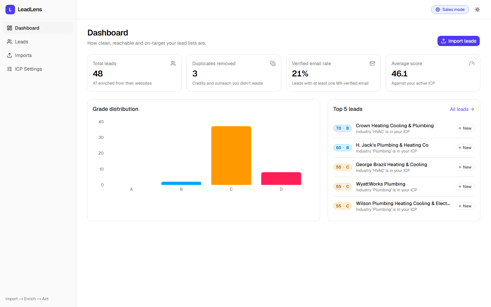
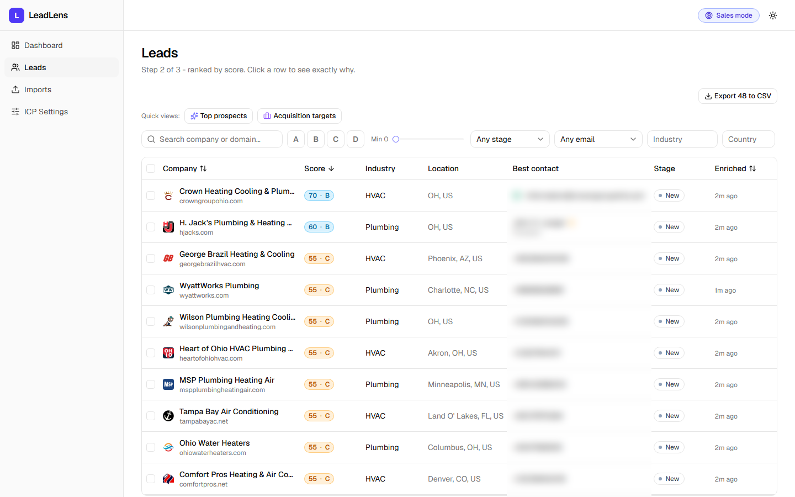
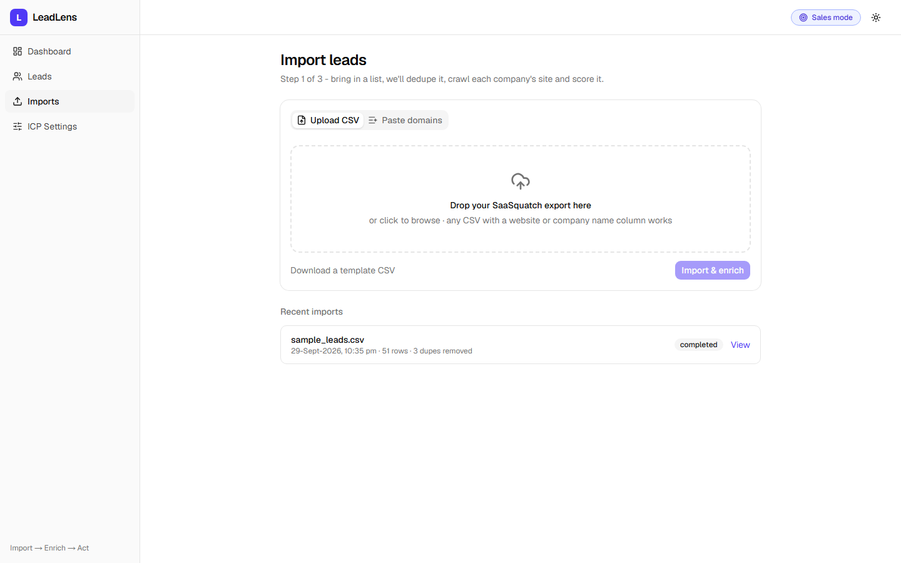
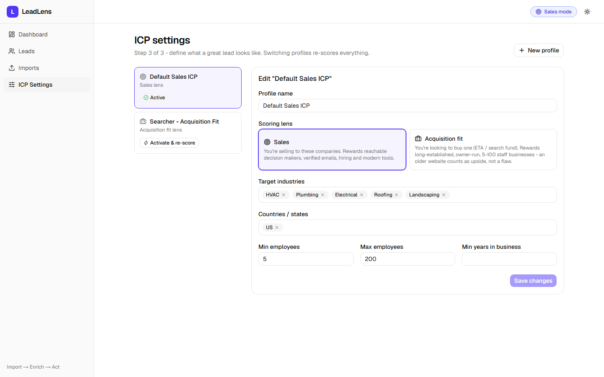

# LeadLens

**Lead intelligence for SaaSquatch exports.** Drop in a raw lead list; get back a
deduplicated, verified, ranked call list - with a plain-English reason for every
score. Flip one switch and the same list is ranked for **buying** a business
instead of selling to it.

[](https://github.com/azamali1144/caprae-capital-assessment/actions/workflows/backend-ci.yml)
[](https://github.com/azamali1144/caprae-capital-assessment/actions/workflows/frontend-ci.yml)

**Video walkthrough:** _link coming_ · **Live demo:** _link coming_

---

## Why

SaaSquatch is great at *finding* companies. The time sink is what happens after
the CSV lands:

1. **Too much noise** - 300 rows, and nobody knows which 20 to call today.
2. **Scores you can't argue with** - a single number with no reason behind it.
3. **Decaying data** - duplicates, dead sites, emails that bounce and burn
   sender reputation (and credits).
4. **Sales ≠ acquisition** - Caprae's world includes searchers. A great *sales*
   lead (growing, hiring, VC-backed) is often a bad *acquisition* target, and the
   reverse: stable, owner-run, 20+ years old, website untouched since 2019.
5. **No workflow** - once exported, leads live in a spreadsheet.

LeadLens is a layer on top of the export that fixes those five things.

## What it does

**Import → Enrich → Act**

- **Import** a SaaSquatch CSV (columns are auto-mapped, any CSV with a website or
  company name works) or just paste domains.
- **Clean** - canonical domains, exact + fuzzy dedup ("ACME, Inc." in Austin =
  "Acme Inc" in Austin, but not the one in Denver), contacts merged.
- **Enrich** from each company's public website: emails (incl. `name [at] domain`
  tricks), phones, socials, founding year, copyright year, "family-owned" language,
  hiring signals, tech stack, and owner / founder names.
- **Validate** - email syntax, MX records, role vs personal inbox, disposable
  domains; phones to E.164; site alive / SSL / blocked.
- **Score** 0-100 with an A-D grade and a line-by-line breakdown, using one of two
  lenses:
  - **Sales** - reachable decision makers, verified emails, hiring, modern tools.
  - **Acquisition fit** - long-established, owner-run, 5-100 staff; an old website
    is *upside*, hiring is a mild negative.
- **Act** - URL-synced filters and presets ("Top prospects", "Acquisition
  targets"), a lead drawer with "Why this score", stages (new → qualified →
  contacted), notes, bulk actions, and a CRM-ready CSV export that respects the
  current filters.

| Dashboard | Leads (contacts blurred) |
|---|---|
|  |  |
| **Import** | **ICP settings** |
|  |  |

_Screenshots are from the sample dataset below. The contact column is blurred
because it holds real people's details published on those businesses' sites._

## Scoring in one table

| Signal | Sales | Acquisition |
|---|---:|---:|
| Industry / location / size in ICP | +20 / +10 / +10 | +20 / +10 / +15 |
| Verified personal email | +15 | +10 |
| Owner / founder / CEO found | +10 | +15 |
| Hiring | +10 | **-5** |
| 10+ years in business | 0 | +10 |
| Website not updated in 3+ years | -5 | **+5** |
| Family / owner operated | 0 | +5 |
| Only generic inboxes | -5 | -5 |
| Site dead | -20 | -20 |

Full model and the reasoning: [docs/scoring.md](docs/scoring.md)

## Architecture

```
Next.js on Vercel ──REST──► FastAPI on Cloud Run ──► Postgres (Neon)
                                   │                 Redis (Upstash)
                                   └──► company websites, DNS
```

| | Choice | Why |
|---|---|---|
| Frontend | Next.js 16, React 19, TypeScript, Tailwind 4, shadcn/ui (Base UI), TanStack Query + Table, nuqs, React Hook Form + Zod, Recharts | fast to build something that feels finished; filters live in the URL |
| Backend | Python 3.12, FastAPI, SQLAlchemy 2 (async) + asyncpg, Alembic, Pydantic v2 | Python owns fetching / parsing / DNS / phone numbers |
| Crawling | httpx (HTTP/2, pooled), selectolax, tenacity, `urllib.robotparser` | polite + fast; robots.txt honoured |
| Data quality | tldextract, rapidfuzz, email-validator, dnspython, phonenumbers | |
| Database | **PostgreSQL** (Neon serverless) | relational data + JSONB for flexible signals + GIN full-text search |
| Cache | **Redis** (Upstash) | per-domain enrichment (7 d), MX (24 h), robots.txt (24 h), stats (30 s) |
| Hosting | Vercel (static + SSR) and **GCP Cloud Run** (serverless container), GCP Secret Manager | scale to zero, container = same thing locally and in prod |
| CI | GitHub Actions - ruff, pytest against real Postgres/Redis, eslint, `tsc`, `next build` | |

Details, ADRs and performance notes: [docs/architecture.md](docs/architecture.md) ·
Deploy guide: [docs/deployment.md](docs/deployment.md)

### Caching & performance

- Re-importing a list doesn't re-crawl anything: enrichment is cached per domain
  (second run of a domain: ~1 ms instead of 3-4 s).
- 10 companies at a time, max 2 requests per host, 0.5 s per-host delay,
  25 s hard cap per company, retries only on timeouts / 5xx / 429.
- Leads-list index matches the default sort (`score DESC NULLS LAST, id`) -
  verified with `EXPLAIN ANALYZE`; full-text search uses a GIN index.
- Exports stream in batches; the dashboard is one SQL round trip, cached 30 s.

### Deployment process

1. PR → GitHub Actions (lint, type-check, tests, build) + Vercel preview.
2. Merge to `main` → Actions builds the API image, pushes to Artifact Registry,
   deploys to Cloud Run (migrations run on boot).
3. Vercel deploys the frontend from `main`.

## UX decisions

- **Three steps, labelled as steps.** Import → Leads → ICP. Every page says which
  step you're on and what happens next.
- **Every number explains itself.** Hover a score for the top reasons; open a lead
  for the full breakdown with +/- bars.
- **Filters are URLs.** Share a view with a teammate, use the back button, bookmark
  "Top prospects".
- **Nothing blocks.** Imports run in the background with live progress; stage
  changes are optimistic; notes save on blur.
- **Grades have fixed colours** (A emerald, B sky, C amber, D rose) across badges,
  filters and the chart, so the eye learns them once. Dark mode included.

## Run it locally

Prereqs: Docker, Python 3.12 + [uv](https://docs.astral.sh/uv/), Node 20+ and pnpm.

```bash
git clone https://github.com/azamali1144/caprae-capital-assessment.git leadlens
cd leadlens
docker compose up -d                      # postgres 16 + redis 7

cd backend
cp .env.example .env
uv sync
uv run alembic upgrade head
uv run python -m scripts.seed_demo        # optional: loads data/sample_leads.csv (~1 min, real crawl)
uv run uvicorn app.main:app --reload      # http://localhost:8000/docs

cd ../frontend
cp .env.example .env.local
pnpm install
pnpm dev                                  # http://localhost:3000
```

### Environment variables

| Backend | Default | |
|---|---|---|
| `DATABASE_URL` | local docker postgres | `postgresql+asyncpg://…` |
| `REDIS_URL` | `redis://localhost:6379/0` | caching is optional - app works without it |
| `CORS_ORIGINS` | `http://localhost:3000` | comma separated |
| `CRAWL_CONCURRENCY` / `CRAWL_PER_HOST_LIMIT` | 10 / 2 | |
| `CRAWL_TIMEOUT_SECONDS` / `LEAD_TIMEOUT_SECONDS` | 10 / 25 | |
| `ENRICH_CACHE_TTL_SECONDS` | 604800 | 7 days |

Frontend: `NEXT_PUBLIC_API_URL` (default `http://localhost:8000/api/v1`).

### Tests

```bash
cd backend && uv run pytest        # unit + an import→export integration test (needs docker postgres)
cd frontend && pnpm lint && pnpm typecheck
```

## Dataset

`data/sample_leads.csv` - 51 real, publicly listed US HVAC / plumbing businesses
(business fields only, no personal data), with 3 deliberate duplicates. Sources,
permissions and the numbers from a real run are in [data/README.md](data/README.md).

## Ethics & compliance

- Only public company websites are crawled; **robots.txt is honoured** and the
  crawler identifies itself (`LeadLensBot/0.1 (+repo url)`).
- Per-host rate limits and a politeness delay. If a site blocks us (403, bot
  wall, CAPTCHA) the lead is marked **blocked** and we move on - no proxy
  rotation or CAPTCHA solving to get around a site's wishes.
- **No LinkedIn scraping** (ToS) - a LinkedIn URL is only stored if the company
  links to it from its own site.
- **No SMTP probing** of mailboxes - MX records only. RCPT checks are unreliable,
  often blocked, and a grey area.
- Only business contact data is stored, and bulk delete removes a company and all
  its contacts (supports GDPR / CCPA erasure requests).

## How I spent the 5 hours

_To fill in - a rough split of feature-coding time (setup, tests, docs and
deploy excluded)._

| Area | Time |
|---|---|
| Ingestion + dedup | |
| Enrichment engine + extractors | |
| Validation + scoring | |
| Jobs + leads API | |
| Frontend (shell, import, leads, drawer, dashboard, ICP) | |

## Trade-offs & what's next

- **Background jobs are in-process.** Fine for a demo; next step is an ARQ worker
  on Redis so the API and crawler scale separately.
- **Static HTML only.** JS-rendered sites return thin pages; a Playwright fallback
  (behind a flag, only when the homepage is nearly empty) is the obvious add.
- **Rule-based people extraction** misses names that aren't next to a title.
- Roadmap: HubSpot push (companies + contacts + score properties), AI-written
  company summary and opener grounded only in the scraped facts, saved views,
  auth + multiple workspaces.

## License

MIT
